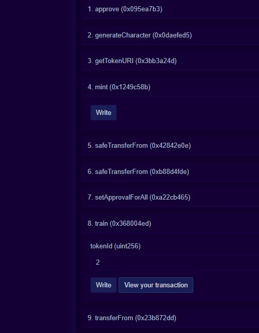
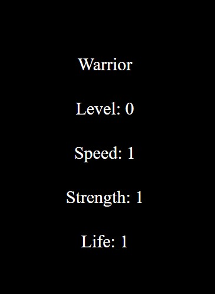

# Chain Battles - NFT with On-Chain Metatdata

When creating NFTs, it is good practice to store the metadata on centralized object storages or decentralized solutions like IPFS, to avoid the humongous Gas fees derived from storing big amounts of data, such as images and JSON Objects, directly on-chain.

There's an issue with this though:

Not storing your metadata on the blockchain will make interacting with it from your smart contract impossible, as the blockchain can't communicate with "the external world".

If we want to update our metadata directly from our smart contract we'll need to store it on-chain, but what about gas fees?

Luckily, L2 chains such as Polygon are here to help, drastically reducing Gas costs, and introducing a number of advantages that allow developers to expand the functionalities of their applications. Develop a fully dynamic NFT with on-chain metadata that changes based on your interactions with it, and deploy it on Polygon Mumbai to lower gas fees.

Try running some of the following tasks:

```shell
npx hardhat help
npx hardhat test
REPORT_GAS=true npx hardhat test
npx hardhat node
npx hardhat run scripts/deploy.js
```

## mumbai-polygon scan tranaction



## nft on opensea

[](https://testnets.opensea.io/assets/mumbai/0xfb39a53286a97500b20c9c15ace800f3820ff21b/2/)
